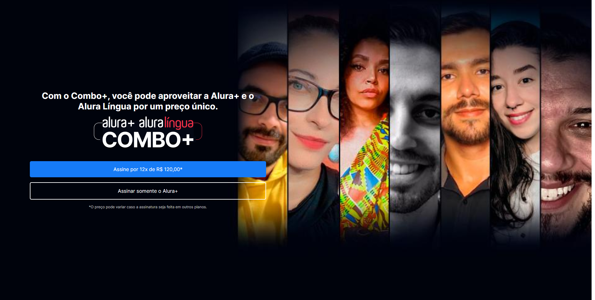

# alura-plus

Projeto desenvolvido durante o curso da Alura HTLML e CSS: praticando HTML/CSS, feito pela Monica Hillman.


📌 Conteúdo
=================
<!--ts-->
   * [Tecnologias](#Tecnologias)
      * [HTML](#HTML)
      * [CSS](#CSS)
<!--te-->

### Fotos
=================
<h1 align="center">
  
</h1>

<h1 align="center">
  
</h1>


### 🎲 Executando a Aplicação

```bash
# Clone este repositório
$ git clone https://github.com/frdbrq/alura-plus.git
# Execute 
```


### Autor
---

<a href="https://github.com/frdbrq">
 
 <br />
 <sub><b>Fred Buarque</b></sub></a> <a href="https://github.com/frdbrq" title="Rocketseat">🚀</a> <br>

### Projeto desenvolvido com carinho após acompanhar as aulas do curso da alura HTML e CSS: Praticando HTML/CSS
